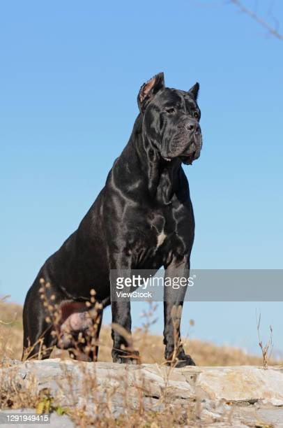

# My Favorite Animal- Dog

---
---
```{r, cars, fig.cap="A scatterplot.", echo=FALSE}
plot(cars)
title("My favorite plot")
```
## Click on CV to view

- [CV](https://www.overleaf.com/read/jpydrrbrcvrq)
